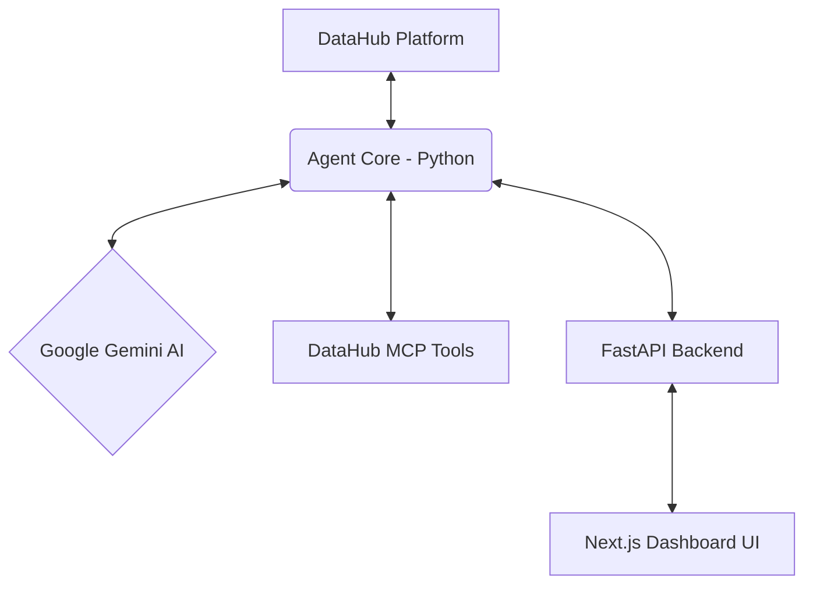

# DataHub Health Guardian Agent 🏥

An autonomous AI agent that monitors your data ecosystem through DataHub, detects anomalies, auto-tags problematic assets, and generates incident reports — all grounded in real DataHub context.

## 🏆 Built for [Build with DataHub: The Agent Hackathon](https://datahub.devpost.com)

Watch the Demo Video: [Link Placeholder](#)

### 📸 Screenshots


## Features

- **🔍 Data Quality Scanner** — Queries DataHub for freshness issues, schema drift, missing metadata
- **🔗 Lineage Impact Analyzer** — Traces upstream/downstream impact when issues are found
- **🏷️ Auto-Tagger** — Automatically tags affected datasets with severity labels
- **📊 Incident Report Generator** — Creates detailed reports with root cause analysis
- **🔔 Alert System** — Notifies data owners about issues
- **🛠️ Self-Healing Suggestions** — Proposes SQL fixes or pipeline patches

## Architecture



## Quick Start

### 1. Clone
```bash
git clone https://github.com/aldorizona10-glitch/datahub-health-guardian.git
cd datahub-health-guardian
```

### 2. Setup Python
```bash
python3 -m venv venv
source venv/bin/activate
pip install -r requirements.txt
```

### 3. Configure
```bash
cp .env.example .env
# Edit .env with your DataHub and Gemini API keys
```

### 4. Run Agent API Server
```bash
python -m uvicorn guardian.server:app --reload
```

### 5. Run Demo Script
```bash
./demo.sh
```

## Configuration

Set the following environment variables in `.env`:

```env
DATAHUB_GMS_URL=http://localhost:8080
DATAHUB_TOKEN=your_datahub_token
GOOGLE_API_KEY=your_gemini_api_key
```

## Tech Stack

- **Agent**: Python 3.11+, Google Gemini API, DataHub Agent Context Kit
- **Backend**: FastAPI, uvicorn
- **Frontend**: HTML5, CSS3, JavaScript (Glassmorphism, Animations)
- **DataHub**: MCP Server, Agent Context Kit, DataHub Skills

## License

MIT
